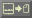

# map-png

A UCP3 module for Stronghold Crusader that adds four buttons under the minimap on the
map editor screens:

| | |
| --- | --- |
|  | import height map |
|  | export height map |
|  | import terrain map |
|  | export terrain map |

PNGs live in `<game directory>/mapping/`, which the module creates on first run.

The buttons use the game's native surround and interaction state, with the four
original PNG images centred inside. Their TGX encodings draw through the native
interface renderer without replacing any vanilla GM image slots.

See [IMPLEMENTATION_PLAN.md](IMPLEMENTATION_PLAN.md) for the original design and
[docs/TESTING.md](docs/TESTING.md) for verification and remaining work.

## Why this exists

The same conversion is possible today with [sourcehold-maps][sourcehold]:

```console
sourcehold memory map set height  --input "map_goldwaters_height.png"
sourcehold memory map set terrain --input "map_goldwaters_tex.png"
sourcehold memory map get terrain --output output.png
sourcehold memory map get height  --output output_height.png
```

That works, but it means a second command prompt, a Python install with numpy, OpenCV
and pymem, and remembering which map layer is which. It also has to attach to the
running game from outside and poke its memory through `pymem`.

A UCP module runs *inside* the game, so none of that is needed. **Nothing is bundled**:
the map layers are ordinary pointer dereferences, and PNG encoding uses `gdiplus.dll`,
which is already part of Windows.

## Status

Working and tested offline:

* the diamond ↔ square tile mapping, verified tile-for-tile against sourcehold's
  `TileLocationTranslator`
* the terrain flag ↔ colour tables, verified against `logics.py` and OpenSHC's
  `Logic1.hpp` / `Logic2.hpp`
* height and terrain export/import, round-trip tested

Verified against the cffi module's source (see the plan, §7): `ffi.load`, `__stdcall`
and callbacks are all available, so the GDI+ route stands and no native DLL is needed.

Written but not yet run in the game:

* the GDI+ PNG bindings
* locating `TileMapState` and forcing the redraw
* the latest native-framed buttons and supplied artwork (offline checks pass;
  live visual testing was deferred at the user's request)

Not written yet:

* the file picker (`mappng/ui/filedialog.lua` falls through to a default name)

The earlier menu-entry crash fixes are in the test copy: preserve the end marker,
convert callback pointers using `ffi.tonumber`, and contain Lua callback errors.
The previous drawing-surface value of zero rendered nothing; the new buttons use
surface 1 and restore the caller's surface afterwards.

## Palettes

Two are available, selected in the UCP GUI:

* **`mappng`** (default) — a lossless round trip.
* **`sourcehold`** — the monsterfish1 palette, byte-for-byte compatible with existing
  sourcehold PNGs. It gives plain earth and both plateau levels the same `#ae9467`, and
  all three moat states the same `#0000ff`, so importing an exported map does not give
  the map back. Use it only when you need to exchange PNGs with the Python tool.

## Development

```console
python -m pip install lupa==2.6 Pillow PyYAML
python tools/build_icons.py
python -m unittest discover -s tests -v
```

The tests run the module's pure-Lua files in a real Lua 5.4 runtime — the same version
the UCP framework uses — with the game and FFI layers stubbed out.

[sourcehold]: https://github.com/sourcehold/sourcehold-maps
